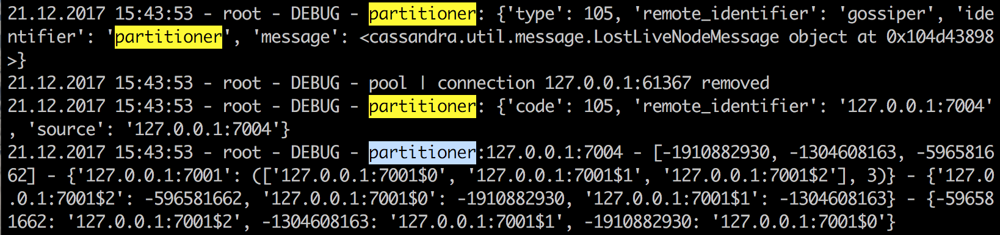
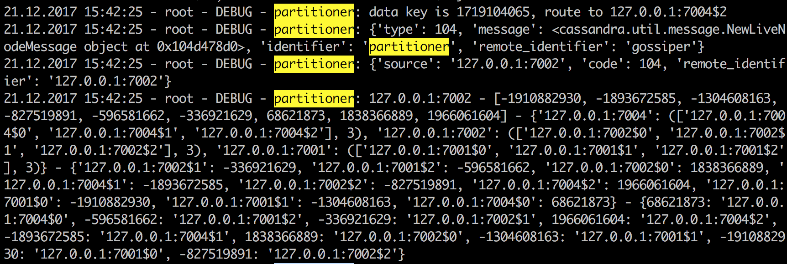
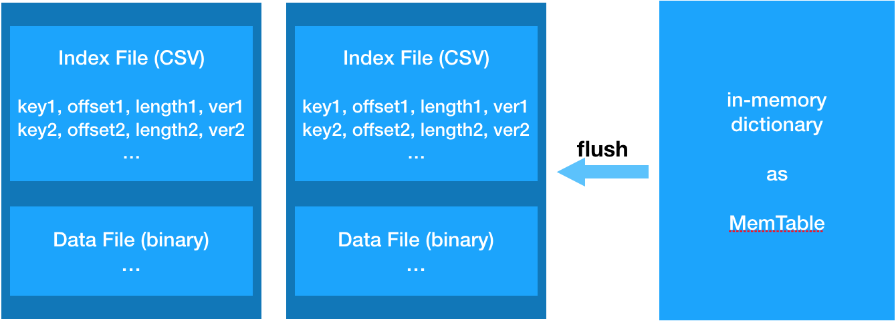
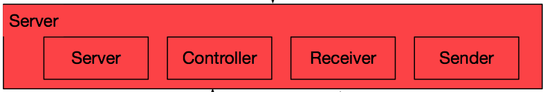

# Naive Cassandra

> course project for *Cloud Data Management (1)*

### 1. Index
* Environment
* Usage
* Architecture
  * P2P architecture
  * Gossip protocol
  * Partitioner
  * replica
  * storager
  * server
  * client
* Experiment And Analysis
  * Data Storage Experiment
  		* Replica Experiment
  		* Virtual Node Experiment
  * Data Query Experiment
 

### 2. Environment

* python 3.5+
* apscheduler (`pip install apscheduler`)
* mmh3 (`pip install mmh3`)

### 3. Usage

`python main.py -c <config_file_path>`

Sample config files can be found at `config/*.ini`

### 4. Architecture

`cassandra/conn`: P2P communication architecture

`cassandra/gossip`: Gossip protocol

`cassandra/util`: utility functions and classes

`cassandra/partitioner`: Partition

##### 4.1 P2P architecture

The P2P architecture is the foundation of the project that provides p2p connection and message transmission between nodes. The architecture is shown in the following picture


###### 4.1.1 Components

Communication between components are implemented by using process-safe queues. There are 3 kinds of queue: `sender_queue`, `receiver_queue` and `message_queue`. All components are run in a queue manner: they listen on a queue (or socket), process the message and then put it into another queue (or socket).

* Sender: sender listens on `sender_queue` and process 2 kinds of queue item: `send message` and `connect`. For the first kind, it send a message through a socket retrieved from a connection pool, while for the second kind, it create a socket, connect to another node, put the socket into connection pool and create the receiver for the socket. To send message or create new connection, put messages in the `sender_queue`.
* Receiver: receiver is created for each established connection. It listens on the socket and parse the received message and put them into `receiver_queue` for further process. It also handles connection loss events.
* Controller: controller is responsible for dispatching messages in `receiver_queue` to the `message_queue` of registered applications. 
* Server: server is used for establishing connections. It listens on a socket and accepts new connections and create new receivers.
* Node/Manager: a node is a combination of sender, receivers, controller and server. Manager is the interface for an application to communicate with the node. Manager provides several functions, including creating connections, sending messages, receiving messages, sending notifications.
* App: APPs are arbitrary applications that might need to communicate with other nodes, such as Gossiper, partitioner. Normal apps derive from `cassandra.util.scheduler.Scheduler`  and has two main tasks: the `internal task` and `interval task`. The `internal task` is a process that runs continuously to do jobs such as listening on the `message_queue` and receiving messages. The `interval task`  is a task that runs periodically.

###### 4.1.2 Use case

The use cases of the p2p architecture and their process are demonstrated below

* Connect new node

  

* Send message to another node

  

* Receive message from another node

  

* Send notification to other apps on the same node

  

##### 4.2 Gossip protocol

* **Gossip timer task**

  > Runs every second. During each of these runs the node initiates gossip exchange according to following rules:
  >
  > 1. Gossip to random live endpoint (if any).
  > 2. Gossip to random unreachable endpoint with certain probability depending on number of unreachable and live nodes.
  > 3. If the node gossiped to at (1) was not seed, or the number of live nodes is less than number of seeds, gossip to random seed with certain probability depending on number of unreachable, seed and live nodes.
  >
  > These rules were developed to ensure that if the network is up, all nodes will eventually know about all other nodes. (Clearly, if each node only contacts one seed and then gossips only to random nodes it knows about, you can have partitions when there are multiple seeds -- each seed will only know about a subset of the nodes in the cluster. Step 3 avoids this and more subtle problems.)
  >
  > This way a node initiates gossip exchange with one to three nodes every round (or zero if it is alone in the cluster)
  >
  > (from https://wiki.apache.org/cassandra/ArchitectureGossip)

* **Data structures**

  * **VersionedValue**. Consists of value and version number
  * **HeartBeatState**. Consists of generation and version number. Generation stays the same when server is running and grows every time the node is started. Used for distinguishing state information before and after a node restart. Version number is shared with application states and guarantees ordering. Each node has one HeartBeatState associated with it.

  * **ApplicationState**. Consists of identifiers of states within cassandra  such as 'STATUS', 'LOAD'.
  * **EndPointState**. Includes all ApplicationStates and HeartBeatState for certain endpoint (node). EndPointState can include only one of each type of ApplicationState, so if EndPointState already includes, say, load information, new load information will overwrite the old one. ApplicationState version number guarantees that old value will not overwrite new one.

  * **endPointStateMap**. Internal structure in Gossiper that has EndPointState for all nodes (including itself) that it has heard about.

* **Gossip Exchange**

  * **GossipDigestSynMessage**. Node starting gossip exchange sends GossipDigestSynMessage, which includes a list of gossip digests. A single gossip digest consists of endpoint address, generation number and maximum version in EndPointState that has been seen for the endpoint. For example, the following message is a serialized GossipDigestSynMessage:

    ```
    b'{"type": "GossipDigestSyn", "params": [["127.0.0.1:7002", 1512784972, 1], ["127.0.0.1:7001", 1512784956.437975, 5]]}'
    ```

  * **GossipDigestAckMessage**. A node receiving GossipDigestSynMessage will examine it and reply with GossipDigestAckMessage, which includes _two_ parts: gossip digest list to request and endpoint state list to send. From the gossip digest list arriving in GossipDigestSynMessage we will know for each endpoint whether the sending node has newer or older information than we do. For example, the following message is a serialized GossipDigestAckMessage(epStateMap is empty because we do not record any state information yet):

    ```
    b'{"type": "GossipDigestAck", "params": {"gDigests": [["127.0.0.1:7001", 1512784956.437975, 0]], "epStateMap": ""}}'
    ```

  * **GossipDigestAck2Message**. Containing any information that remote endpoint requested or needs to be updated in gossip digest list of GossipDigestAckMessage. For example:

    ```
    b'{"type": "GossipDigestAck2", "params": "127.0.0.1:7001-[HeartBeat, generation 1512784956, version 5]"}'
    ```

##### 4.3 Partitioner

* **Partitioner task**

  > Polling for status of each physical node and read/write requests. 
  > 1. For new connecting nodes, create virtual node for the new physical nodes, register them to the dht table.
  > 2. For connection lost nodes, delete them from the dht table.
  > 3. For data write\read request, route it to the corresponding node.

* **Partitioner Exchange**

   * **NewLiveNodeMessage**. Gossiper would send this notification when new node is added to the liveEndpoints list

    ```
    {'type': NewLiveNodeMessage, 'identifier': 'partitioner', 'remote_identifier': 'gossiper' message:{'source': '127.0.0.1:7002', 'code': 104, 'remote_identifier': '127.0.0.1:7002'}}
    ```
   * **LostLiveNodeMessage**. Gossiper would send this notification when new node is removed from the liveEndpoints list

    ```
    {'type': LostLiveNodeMessage, 'identifier': 'partitioner', 'remote_identifier': 'gossiper' message:{'source': '127.0.0.1:7002', 'code': 104, 'remote_identifier': '127.0.0.1:7002'}}
    ```

* Connect new node

  

* Lost live node

  


##### 4.4 Storager
* **Partitioner task**
	
	> Receive data from server and cache it in the temporary in-memory table. 
	> Build index file for each row and cache some of the index to fasten the query processing.
	> To limit the usage of the memory used for caching index file, we use LRU principle to guide the placing of index file.




##### 4.5 Server
* **Server task**
	
	> Receive requests from client (get\put\batchput)
	> Get physical node address from partitioner and send request to corresponding node.
	> Get response from corresponding node and send the response when the sending conditions are satisfied.
	> Saving version message for each key to support read repair.



Reuse the sender and receiver in node.py to simplify the code.

##### 4.6 Client
* **Client task**
	
	> Receive requests from client (get\put\batchput)
	> Get physical node address from partitioner and send request to corresponding node.
	> Get response from corresponding node and send the response when the sending conditions are satisfied.
	> Saving version message for each key to support read repair.


#### 5. Experiment And Analysis
To test the effectiveness of Naive-Cassandra, We did a experiment on inputing data \ querying data on a three-node cluster of Naive-Cassandra. We use the order table of tpc-h data as the original experiment dataset. By random selection of the original order table, different size datasets are built. Each experiment are repeated 3 times using different random dataset. The results are as follows: 
##### 5.1 Data Storage Experiment

replica-factor = 1
virtual-node-num = 3

tool | mode | input speed
---------- | --------- | ----
Naive-Cassandra | parallel | 1026 rows/s
Naive-Cassandra | simple   | 200 rows/s
Cassandra       | N\A      | 9804 rows/s

###### 5.1.1 Replica Experiment

virtual-node-num = 3

tool | replica-factor | mode | input speed
---------- | ------- | --------- | ----
Naive-Cassandra | 1 | parallel | 1026 rows/s
Naive-Cassandra | 1 | simple   | 200 rows/s
Naive-Cassandra | 2 | parallel | 972 rows/s
Naive-Cassandra | 2 | simple   | 174 rows/s
Naive-Cassandra | 3 | parallel | 914 rows/s
Naive-Cassandra | 3 | simple   | 152 rows/s

###### 5.1.2 Virtual Node Experiment

replica-factor = 1

tool | virtual-node-num| data rate
---------- | ------ | --------- 
Naive-Cassandra | 1 | 55 : 33 : 35
Naive-Cassandra | 2 | 47 : 35 : 41
Naive-Cassandra | 3 | 49 : 37 : 37

##### 5.2 Data Query Experiment

replica-factor = 1
virtual-node-num = 3

tool | mode | query speed
---------- | --------- | ----
Naive-Cassandra | parallel | 563 rows/s
Naive-Cassandra | simple   | 116 rows/s
Cassandra       | N\A      | 5702 rows/s

##### 5.3 Analysis
From the above results, we can see that Naive-Cassandra is almost 50 times slower than original Cassandra on loading `.csv` file using simple input, 10 times slower using parallel input. That is reasonable: While using simple input, the client has to wait for the response for each row's put request. That could be a great drawback. When it comes to parallel input, the situation becomes different: client would not waiting for the response of server, so in this mode, input is much faster. But because of the message queue we used, the local processing time could be longer. Also, to fasten the processing of file input, Cassandra using batch input technique to fasten the file input: instead of processing by row, Cassandra will process 1000 rows each time, that could be a definite improvement on data input. The query processing is similar.

From the virtual node experiment we can infer that increase the number of virtual node can slightly help with the load balancing of the cluster. But it won't help a lot since the partition of murmur-hash may be good enough when the hash result is a int32.

From the replica factor experiment we can infer that increase replica factor would slightly slow down the data input process, but since the robustness of system is also important, at least we should set the factor to 2. 


